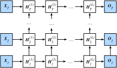

# 深度循环神经网络

本章到目前为止介绍的循环神经网络只有一个单向的隐藏层，在深度学习应用里，我们通常会用到含有多个隐藏层的循环神经网络，也称作深度循环神经网络。图6.11演示了一个有$L$个隐藏层的深度循环神经网络，每个隐藏状态不断传递至当前层的下一时间步和当前时间步的下一层。

具体来说，在时间步$t$里，设小批量输入$\boldsymbol{X}_t \in \mathbb{R}^{n \times d}$（样本数为$n$，输入个数为$d$），第$\ell$隐藏层（$\ell=1,\ldots,L$）的隐藏状态为$\boldsymbol{H}_t^{(\ell)}  \in \mathbb{R}^{n \times h}$（隐藏单元个数为$h$），输出层变量为$\boldsymbol{O}_t \in \mathbb{R}^{n \times q}$（输出个数为$q$），且隐藏层的激活函数为$\phi$。第1隐藏层的隐藏状态和之前的计算一样：

$$\boldsymbol{H}_t^{(1)} = \phi(\boldsymbol{X}_t \boldsymbol{W}_{xh}^{(1)} + \boldsymbol{H}_{t-1}^{(1)} \boldsymbol{W}_{hh}^{(1)}  + \boldsymbol{b}_h^{(1)}),$$

其中权重$\boldsymbol{W}_{xh}^{(1)} \in \mathbb{R}^{d \times h}, \boldsymbol{W}_{hh}^{(1)} \in \mathbb{R}^{h \times h}$和偏差 $\boldsymbol{b}_h^{(1)} \in \mathbb{R}^{1 \times h}$分别为第1隐藏层的模型参数。

当$1 < \ell \leq L$时，第$\ell$隐藏层的隐藏状态的表达式为

$$\boldsymbol{H}_t^{(\ell)} = \phi(\boldsymbol{H}_t^{(\ell-1)} \boldsymbol{W}_{xh}^{(\ell)} + \boldsymbol{H}_{t-1}^{(\ell)} \boldsymbol{W}_{hh}^{(\ell)}  + \boldsymbol{b}_h^{(\ell)}),$$

其中权重$\boldsymbol{W}_{xh}^{(\ell)} \in \mathbb{R}^{h \times h}, \boldsymbol{W}_{hh}^{(\ell)} \in \mathbb{R}^{h \times h}$和偏差 $\boldsymbol{b}_h^{(\ell)} \in \mathbb{R}^{1 \times h}$分别为第$\ell$隐藏层的模型参数。

最终，输出层的输出只需基于第$L$隐藏层的隐藏状态：

$$\boldsymbol{O}_t = \boldsymbol{H}_t^{(L)} \boldsymbol{W}_{hq} + \boldsymbol{b}_q,$$

其中权重$\boldsymbol{W}_{hq} \in \mathbb{R}^{h \times q}$和偏差$\boldsymbol{b}_q \in \mathbb{R}^{1 \times q}$为输出层的模型参数。

同多层感知机一样，隐藏层个数$L$和隐藏单元个数$h$都是超参数。此外，如果将隐藏状态的计算换成门控循环单元或者长短期记忆的计算，我们可以得到深度门控循环神经网络。

## 小结

* 在深度循环神经网络中，隐藏状态的信息不断传递至当前层的下一时间步和当前时间步的下一层。

## 练习

* 将[“循环神经网络的从零开始实现”](rnn-scratch.md)一节中的模型改为含有2个隐藏层的循环神经网络。观察并分析实验现象。

## 扫码直达[讨论区](https://discuss.gluon.ai/t/topic/6730)

