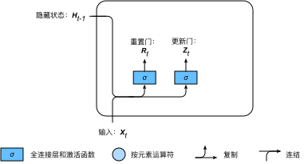

# 门控循环单元（GRU）

上一节介绍了循环神经网络中的梯度计算方法。我们发现，当时间步数较大或者时间步较小时，循环神经网络的梯度较容易出现衰减或爆炸。虽然裁剪梯度可以应对梯度爆炸，但无法解决梯度衰减的问题。通常由于这个原因，循环神经网络在实际中较难捕捉时间序列中时间步距离较大的依赖关系。

门控循环神经网络（gated recurrent neural network）的提出，正是为了更好地捕捉时间序列中时间步距离较大的依赖关系。它通过可以学习的门来控制信息的流动。其中，门控循环单元（gated recurrent unit，简称GRU）是一种常用的门控循环神经网络 [1, 2]。另一种常见门控循环神经网络则将在下一节中介绍。


## 门控循环单元

下面将介绍门控循环单元的设计。它引入了重置门和更新门的概念，从而修改了循环神经网络中隐藏状态的计算方式。

### 重置门和更新门

如图6.4所示，门控循环单元中的重置门（reset gate）和更新门（update gate）的输入均为当前时间步输入$\boldsymbol{X}_t$与上一时间步隐藏状态$\boldsymbol{H}_{t-1}$，输出由激活函数为sigmoid函数的全连接层计算得到。





具体来说，假设隐藏单元个数为$h$，给定时间步$t$的小批量输入$\boldsymbol{X}_t \in \mathbb{R}^{n \times d}$（样本数为$n$，输入个数为$d$）和上一时间步隐藏状态$\boldsymbol{H}_{t-1} \in \mathbb{R}^{n \times h}$。重置门$\boldsymbol{R}_t \in \mathbb{R}^{n \times h}$和更新门$\boldsymbol{Z}_t \in \mathbb{R}^{n \times h}$的计算如下：

$$
\begin{aligned}
\boldsymbol{R}_t = \sigma(\boldsymbol{X}_t \boldsymbol{W}_{xr} + \boldsymbol{H}_{t-1} \boldsymbol{W}_{hr} + \boldsymbol{b}_r),\\
\boldsymbol{Z}_t = \sigma(\boldsymbol{X}_t \boldsymbol{W}_{xz} + \boldsymbol{H}_{t-1} \boldsymbol{W}_{hz} + \boldsymbol{b}_z),
\end{aligned}
$$

其中$\boldsymbol{W}_{xr}, \boldsymbol{W}_{xz} \in \mathbb{R}^{d \times h}$和$\boldsymbol{W}_{hr}, \boldsymbol{W}_{hz} \in \mathbb{R}^{h \times h}$是权重参数，$\boldsymbol{b}_r, \boldsymbol{b}_z \in \mathbb{R}^{1 \times h}$是偏差参数。[“多层感知机”](../chapter_deep-learning-basics/mlp.md)一节中介绍过，sigmoid函数可以将元素的值变换到0和1之间。因此，重置门$\boldsymbol{R}_t$和更新门$\boldsymbol{Z}_t$中每个元素的值域都是$[0, 1]$。

### 候选隐藏状态

接下来，门控循环单元将计算候选隐藏状态来辅助稍后的隐藏状态计算。如图6.5所示，我们将当前时间步重置门的输出与上一时间步隐藏状态做按元素乘法（符号为$\odot$）。如果重置门中元素值接近0，那么意味着重置对应隐藏状态元素为0，即丢弃上一时间步的隐藏状态。如果元素值接近1，那么表示保留上一时间步的隐藏状态。然后，将按元素乘法的结果与当前时间步的输入连结，再通过含激活函数tanh的全连接层计算出候选隐藏状态，其所有元素的值域为$[-1, 1]$。


具体来说，时间步$t$的候选隐藏状态$\tilde{\boldsymbol{H}}_t \in \mathbb{R}^{n \times h}$的计算为

$$\tilde{\boldsymbol{H}}_t = \text{tanh}(\boldsymbol{X}_t \boldsymbol{W}_{xh} + \left(\boldsymbol{R}_t \odot \boldsymbol{H}_{t-1}\right) \boldsymbol{W}_{hh} + \boldsymbol{b}_h),$$

其中$\boldsymbol{W}_{xh} \in \mathbb{R}^{d \times h}$和$\boldsymbol{W}_{hh} \in \mathbb{R}^{h \times h}$是权重参数，$\boldsymbol{b}_h \in \mathbb{R}^{1 \times h}$是偏差参数。从上面这个公式可以看出，重置门控制了上一时间步的隐藏状态如何流入当前时间步的候选隐藏状态。而上一时间步的隐藏状态可能包含了时间序列截至上一时间步的全部历史信息。因此，重置门可以用来丢弃与预测无关的历史信息。

### 隐藏状态

最后，时间步$t$的隐藏状态$\boldsymbol{H}_t \in \mathbb{R}^{n \times h}$的计算使用当前时间步的更新门$\boldsymbol{Z}_t$来对上一时间步的隐藏状态$\boldsymbol{H}_{t-1}$和当前时间步的候选隐藏状态$\tilde{\boldsymbol{H}}_t$做组合：

$$\boldsymbol{H}_t = \boldsymbol{Z}_t \odot \boldsymbol{H}_{t-1}  + (1 - \boldsymbol{Z}_t) \odot \tilde{\boldsymbol{H}}_t.$$


值得注意的是，更新门可以控制隐藏状态应该如何被包含当前时间步信息的候选隐藏状态所更新，如图6.6所示。假设更新门在时间步$t'$到$t$（$t' < t$）之间一直近似1。那么，在时间步$t'$到$t$之间的输入信息几乎没有流入时间步$t$的隐藏状态$\boldsymbol{H}_t$。实际上，这可以看作是较早时刻的隐藏状态$\boldsymbol{H}_{t'-1}$一直通过时间保存并传递至当前时间步$t$。这个设计可以应对循环神经网络中的梯度衰减问题，并更好地捕捉时间序列中时间步距离较大的依赖关系。

我们对门控循环单元的设计稍作总结：

* 重置门有助于捕捉时间序列里短期的依赖关系。
* 更新门有助于捕捉时间序列里长期的依赖关系。

## 读取数据集

为了实现并展示门控循环单元，我们依然使用周杰伦歌词数据集来训练模型作词。这里除门控循环单元以外的实现已在[“循环神经网络”](rnn.md)一节中介绍。以下为读取数据集部分。

```{.python .input  n=1}
import d2lzh as d2l
from mxnet import nd
from mxnet.gluon import rnn

(corpus_indices, char_to_idx, idx_to_char,
 vocab_size) = d2l.load_data_jay_lyrics()
```

## 从零开始实现

我们先介绍如何从零开始实现门控循环单元。

### 初始化模型参数

以下部分对模型参数进行初始化。超参数`num_hiddens`定义了隐藏单元的个数。

```{.python .input  n=2}
num_inputs, num_hiddens, num_outputs = vocab_size, 256, vocab_size
ctx = d2l.try_gpu()

def get_params():
    def _one(shape):
        return nd.random.normal(scale=0.01, shape=shape, ctx=ctx)

    def _three():
        return (_one((num_inputs, num_hiddens)),
                _one((num_hiddens, num_hiddens)),
                nd.zeros(num_hiddens, ctx=ctx))

    W_xz, W_hz, b_z = _three()  # 更新门参数。
    W_xr, W_hr, b_r = _three()  # 重置门参数。
    W_xh, W_hh, b_h = _three()  # 候选隐藏状态参数。
    # 输出层参数。
    W_hq = _one((num_hiddens, num_outputs))
    b_q = nd.zeros(num_outputs, ctx=ctx)
    # 创建梯度。
    params = [W_xz, W_hz, b_z, W_xr, W_hr, b_r, W_xh, W_hh, b_h, W_hq, b_q]
    for param in params:
        param.attach_grad()
    return params
```

### 定义模型

以下定义隐藏状态初始化函数`init_gru_state`。同[“循环神经网络的从零开始实现”](rnn-scratch.md)一节中定义的`init_rnn_state`函数一样，它返回由一个形状为（批量大小，隐藏单元个数）的值为0的NDArray组成的元组。

```{.python .input  n=3}
def init_gru_state(batch_size, num_hiddens, ctx):
    return (nd.zeros(shape=(batch_size, num_hiddens), ctx=ctx), )
```

下面根据门控循环单元的计算表达式定义模型。

```{.python .input  n=4}
def gru(inputs, state, params):
    W_xz, W_hz, b_z, W_xr, W_hr, b_r, W_xh, W_hh, b_h, W_hq, b_q = params
    H, = state
    outputs = []
    for X in inputs:
        Z = nd.sigmoid(nd.dot(X, W_xz) + nd.dot(H, W_hz) + b_z)
        R = nd.sigmoid(nd.dot(X, W_xr) + nd.dot(H, W_hr) + b_r)
        H_tilda = nd.tanh(nd.dot(X, W_xh) + R * nd.dot(H, W_hh) + b_h)
        H = Z * H + (1 - Z) * H_tilda
        Y = nd.dot(H, W_hq) + b_q
        outputs.append(Y)
    return outputs, (H,)
```

### 训练模型并创作歌词

我们在训练模型时只使用相邻采样。设置好超参数后，我们将训练模型并根据前缀“分开”和“不分开”分别创作长度为50个字符的一段歌词。

```{.python .input  n=5}
num_epochs, num_steps, batch_size, lr, clipping_theta = 160, 35, 32, 1e2, 1e-2
pred_period, pred_len, prefixes = 40, 50, ['分开', '不分开']
```

我们每过40个迭代周期便根据当前训练的模型创作一段歌词。

```{.python .input}
d2l.train_and_predict_rnn(gru, get_params, init_gru_state, num_hiddens,
                          vocab_size, ctx, corpus_indices, idx_to_char,
                          char_to_idx, False, num_epochs, num_steps, lr,
                          clipping_theta, batch_size, pred_period, pred_len,
                          prefixes)
```

## 简洁实现

在Gluon中我们直接调用`rnn`模块中的`GRU`类即可。

```{.python .input  n=6}
gru_layer = rnn.GRU(num_hiddens)
model = d2l.RNNModel(gru_layer, vocab_size)
d2l.train_and_predict_rnn_gluon(model, num_hiddens, vocab_size, ctx,
                                corpus_indices, idx_to_char, char_to_idx,
                                num_epochs, num_steps, lr, clipping_theta,
                                batch_size, pred_period, pred_len, prefixes)
```

## 小结

* 门控循环神经网络可以更好地捕捉时间序列中时间步距离较大的依赖关系。
* 门控循环单元引入了门的概念，从而修改了循环神经网络中隐藏状态的计算方式。它包括重置门、更新门、候选隐藏状态和隐藏状态。
* 重置门有助于捕捉时间序列里短期的依赖关系。
* 更新门有助于捕捉时间序列里长期的依赖关系。


## 练习

* 假设时间步$t' < t$。如果我们只希望用时间步$t'$的输入来预测时间步$t$的输出，每个时间步的重置门和更新门的值最好是多少？
* 调节超参数，观察并分析对运行时间、困惑度以及创作歌词的结果造成的影响。
* 在相同条件下，比较门控循环单元和不带门控的循环神经网络的运行时间。


## 扫码直达[讨论区](https://discuss.gluon.ai/t/topic/4042)


## 参考文献

[1] Cho, K., Van Merriënboer, B., Bahdanau, D., & Bengio, Y. (2014). On the properties of neural machine translation: Encoder-decoder approaches. arXiv preprint arXiv:1409.1259.

[2] Chung, J., Gulcehre, C., Cho, K., & Bengio, Y. (2014). Empirical evaluation of gated recurrent neural networks on sequence modeling. arXiv preprint arXiv:1412.3555.
